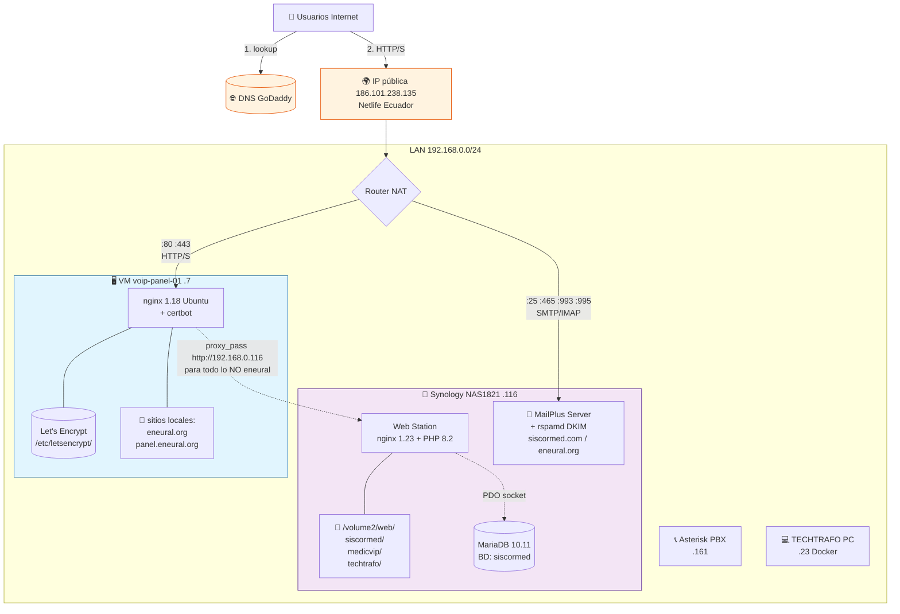

# Infraestructura de hosting — vista general

Diagrama y notas operativas del hosting compartido donde vive `siscormed.com`
junto con el resto de dominios bajo la misma IP pública.

Última verificación: 2026-05-23.

---

## 🗺️ Mapa de dominios

| Dominio                  | DNS                          | TLS termina en | Backend (contenido)                              |
| ------------------------ | ---------------------------- | -------------- | ------------------------------------------------ |
| `eneural.org`            | A → 186.101.238.135          | VM `.7`        | **Local en VM `.7`** (no proxy)                  |
| `panel.eneural.org`      | A → 186.101.238.135          | VM `.7`        | **Local en VM `.7`** (no proxy)                  |
| `siscormed.com`          | A → 186.101.238.135          | VM `.7` (SAN cubre `+www`) | proxy → NAS `.116` `/volume2/web/siscormed`      |
| `www.siscormed.com`      | CNAME → `siscormed.com`      | VM `.7` (mismo cert) | **301 → `https://siscormed.com`**           |
| `medicvip.org`           | A → 186.101.238.135          | VM `.7`        | proxy → NAS `.116`                               |
| `techtrafo.com`          | A → 186.101.238.135          | VM `.7` (cubre `+www`) | proxy → NAS `.116`                          |
| `www.techtrafo.com`      | CNAME → `techtrafo.com`      | VM `.7` (mismo cert) | mismo content que `techtrafo.com`           |
| `panel.techtrafo.com`    | A → 186.101.238.135          | VM `.7`        | proxy → NAS `.116`                               |
| `api.techtrafo.com`      | A → 186.101.238.135          | VM `.7` (cert de `panel.techtrafo.com`) | proxy → NAS `.116`              |
| `mail.siscormed.com`     | A → 186.101.238.135          | NAS `.116` directo (cert Synology aparte) | MailPlus en NAS `.116`           |

---

## 🔀 Flujo de una request HTTPS



---

## 🧱 ASCII fallback (por si el Mermaid no carga)

```
                          ┌──────────────────────────┐
                          │    🌍 Internet           │
                          │    Usuarios              │
                          └────────────┬─────────────┘
                                       │
                          ┌────────────▼─────────────┐
                          │ DNS GoDaddy              │
                          │ resuelve a:              │
                          │ 186.101.238.135 (Netlife)│
                          └────────────┬─────────────┘
                                       │ HTTP/HTTPS, SMTP
                          ┌────────────▼─────────────┐
                          │   Router / NAT           │
                          └─────┬─────────────┬──────┘
                       :80/:443│             │:25 :465 :993
                                ▼             │
        ┌───────────────────────────────────┐ │
        │  VM   voip-panel-01    .7         │ │
        │  Ubuntu 22.04 + nginx 1.18        │ │
        │  certbot (/etc/letsencrypt/)      │ │
        │                                   │ │
        │  ┌─ LOCAL ─────────────────────┐  │ │
        │  │ eneural.org                 │  │ │
        │  │ panel.eneural.org           │  │ │
        │  └─────────────────────────────┘  │ │
        │                                   │ │
        │  ┌─ PROXY → NAS ───────────────┐  │ │
        │  │ siscormed.com (+www→301)    │  │ │
        │  │ medicvip.org                │  │ │
        │  │ techtrafo.com (+www)        │  │ │
        │  │ panel.techtrafo.com         │  │ │
        │  │ api.techtrafo.com           │  │ │
        │  └─────────┬───────────────────┘  │ │
        └────────────┼──────────────────────┘ │
                     │ proxy_pass HTTP        │
                     │ (LAN)                  │
                     ▼                        ▼
        ┌──────────────────────────────────────────────┐
        │  NAS Synology NAS1821     .116               │
        │  ┌────────────────────────────────────────┐  │
        │  │ Web Station   nginx 1.23 + PHP 8.2     │  │
        │  │   /volume2/web/siscormed   ← /api/*    │  │
        │  │   /volume2/web/medicvip                │  │
        │  │   /volume2/web/techtrafo               │  │
        │  └────────────────┬───────────────────────┘  │
        │                   │ PDO socket               │
        │  ┌────────────────▼───────────────────────┐  │
        │  │ MariaDB 10.11   BD: siscormed          │  │
        │  │   pacientes, audit, admin_usuarios     │  │
        │  └────────────────────────────────────────┘  │
        │                                              │
        │  ┌────────────────────────────────────────┐  │
        │  │ MailPlus Server   SMTP/IMAP            │  │
        │  │   + rspamd DKIM signing                │  │
        │  │     eneural.org   (selector: mail)     │  │
        │  │     siscormed.com (selector: mail)     │  │
        │  └────────────────────────────────────────┘  │
        └──────────────────────────────────────────────┘
                    │
                    │  (otros equipos LAN)
                    ▼
        ┌───────────────────────────────────────┐
        │ .161  Asterisk PBX  (UDP 5060/5061)   │
        │ .23   TECHTRAFO PC Ubuntu + Docker    │
        └───────────────────────────────────────┘
```

---

## 📝 Notas operativas

### Flujo TLS
- **Cliente** habla TLS con la VM `.7` (cert Let's Encrypt termina ahí).
- **VM → NAS** es HTTP plano por LAN. El header `X-Forwarded-Proto: https` se setea para que el backend sepa que el origen fue HTTPS.

### Donde viven los certs reales
- Todos los certs públicos están en la VM `.7` bajo `/etc/letsencrypt/live/<domain>/`.
- El cert del NAS solo cubre `mail.siscormed.com` y un cert legacy de `siscormed.com` que **no se sirve públicamente** (queda como fallback interno).

### Email auth de siscormed.com (DNS GoDaddy)
- **SPF:** `v=spf1 ip4:186.101.238.135 include:secureserver.net ~all`
- **DKIM:** `mail._domainkey.siscormed.com` — selector `mail`, key en `/var/packages/MailPlus-Server/target/etc/rspamd/dkim/siscormed.com.mail.key`
- **DMARC:** `_dmarc.siscormed.com` actualmente en `p=none` (monitoring). Plan: subir a `p=quarantine` tras ~1 semana de reportes limpios.

### Reglas que aplican siempre
- ⚠️ **Nunca tocar** los server blocks de `eneural.org` ni `panel.eneural.org` en el archivo `netvoice` de la VM — son críticos y sirven localmente, no por proxy.
- Cualquier cambio de SSL/dominio se hace **en la VM `.7`**, NO en el NAS.
- Para agregar un dominio nuevo: ver el [checklist en el README principal](../README.md) (futuro) o seguir el patrón de `techtrafo.com` en `/etc/nginx/sites-available/netvoice`.

### Equipos LAN no-web mencionados
- `.116` — Synology NAS1821 (este doc)
- `.7` — VM `voip-panel-01` (este doc)
- `.161` — Asterisk PBX (no parte del hosting web)
- `.23` — TECHTRAFO PC Ubuntu + Docker (no parte del hosting web)
